# Journal Memory Assistant

A comprehensive journaling application that lets users capture moments through photos, audio reflections, and text notes, with powerful semantic search capabilities powered by Mem0's multimodal memory layer.

## Project Overview

Journal Memory Assistant is designed for users who want to capture daily moments of inspiration, gratitude, and reflection through multiple media formats. The application features:

- **Multimodal Journaling**: Create entries as photos, audio recordings, or text notes
- **Semantic Search**: Find entries through natural language queries
- **Rich Metadata**: Tag, categorize, and organize journal entries with mood indicators and location data
- **AI-Powered Processing**: Analyze images with Gemini and transcribe audio with AssemblyAI

## Screenshots

Here's a visual tour of the Journal Memory Assistant application:

<div style="display: flex; flex-wrap: wrap; gap: 10px; justify-content: center;">
  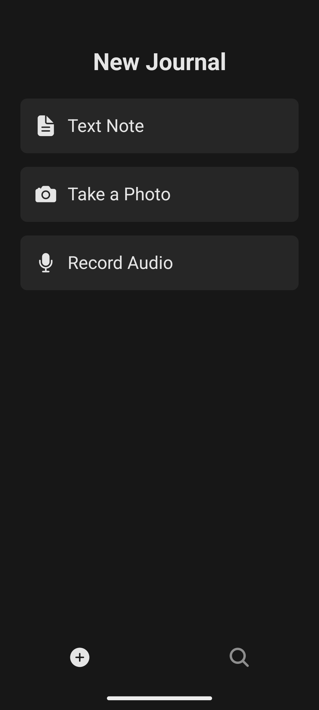
  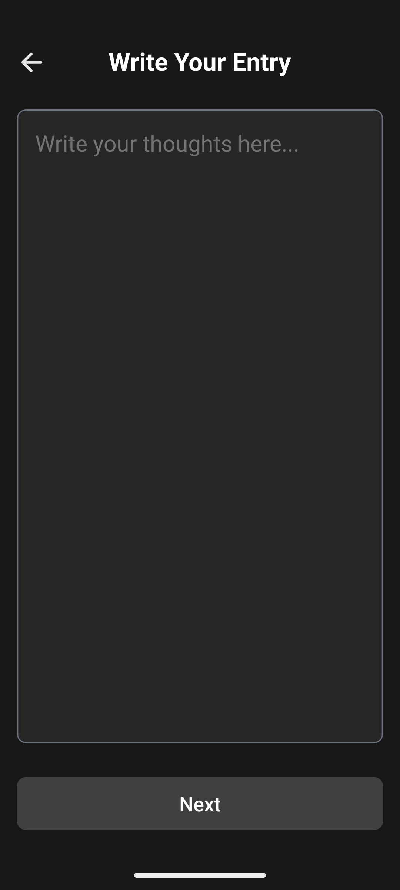
  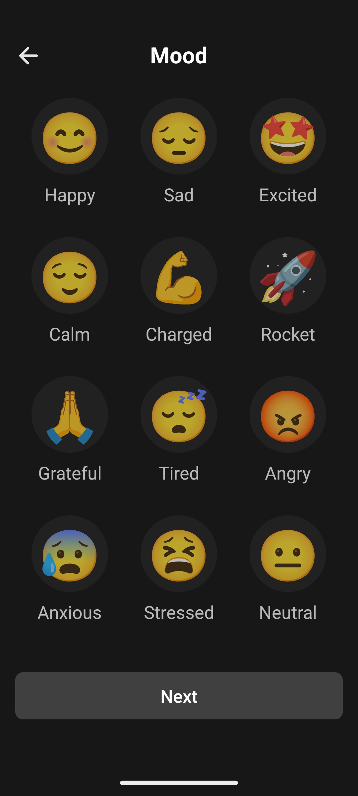
  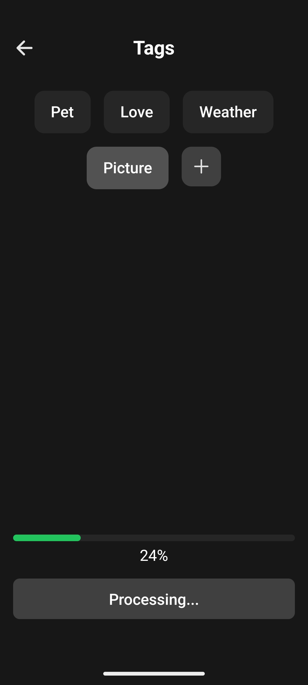
  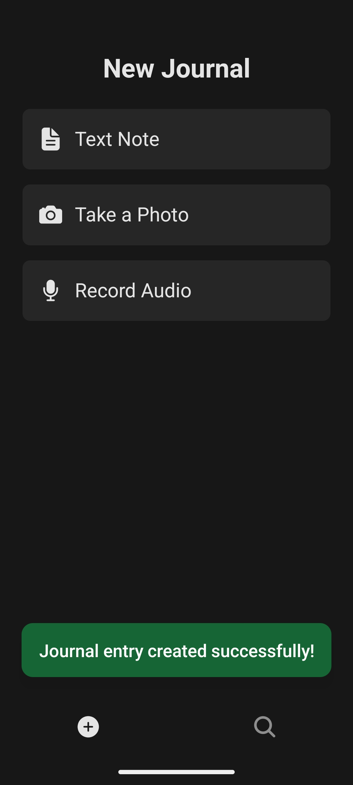
  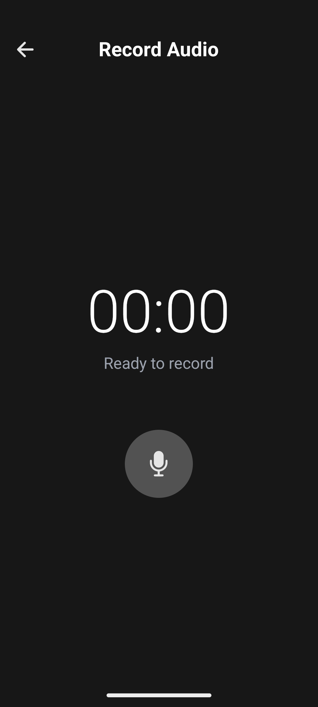
  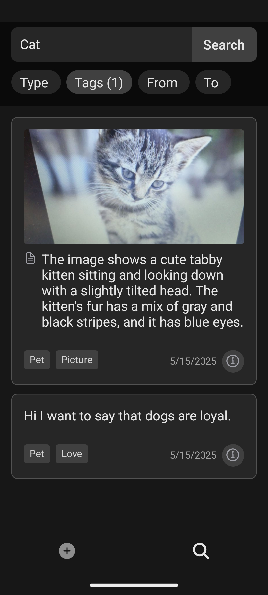
  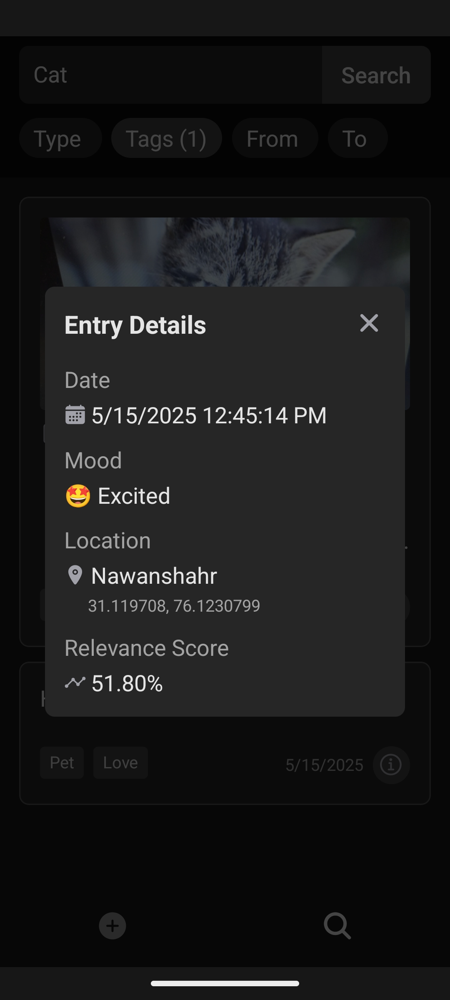
  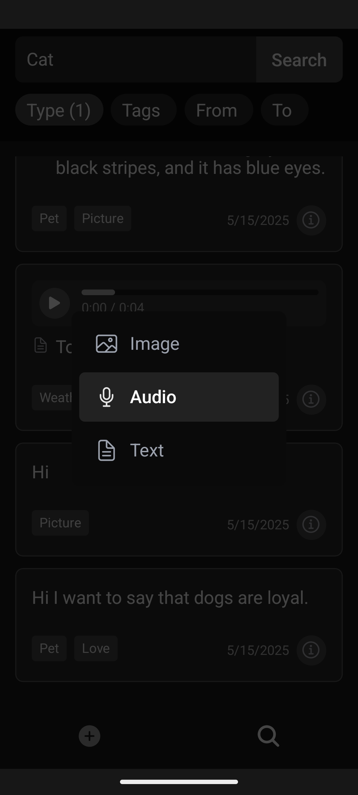
  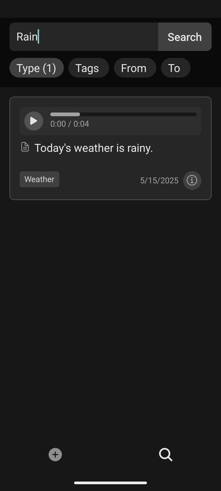
  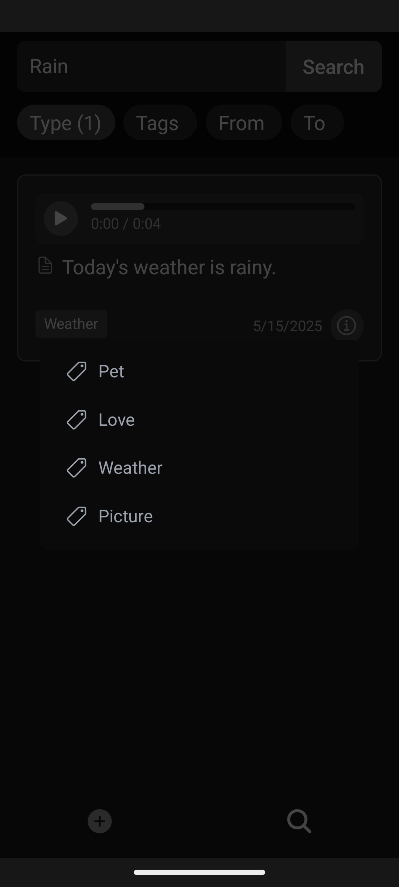
</div>

## Repository Structure

- `/mobile` - React Native mobile application
- `/server` - Node.js backend service with Mem0 integration
- `/shared` - Shared types and utilities between client and server
- `/screenshots` - Application screenshots

## Mobile App Features

- **Multimodal Journal Entries**:
  - Capture photos using Expo Camera with front/back camera switching
  - Record high-quality audio reflections with live recording timer
  - Write text entries with custom formatting
- **Rich Metadata**:
  - Tag entries for easier organization and retrieval
  - Add mood indicators to track emotional states
  - Automatically capture timestamps and optional location data
- **Local & Cloud Storage**:
  - MMKV for efficient local storage of tags and media mappings
  - S3 integration for secure cloud storage of media files
  - Background upload support with progress tracking

## Server Features

- **RESTful API Endpoints**:

  - Create journal entries (images, audio, text)
  - Search entries with semantic understanding
  - Generate pre-signed URLs for direct media uploads

- **Multimodal Processing**:

  - Process images using Google's Gemini API for image description
  - Transcribe audio recordings with AssemblyAI
  - Generate text embeddings for semantic search via Mem0

- **Metadata Management**:
  - Store entry timestamps, tags, moods
  - Support location-based filtering
  - Index content for fast retrieval

## Getting Started

### Prerequisites

- Node.js (16.x or higher)
- npm or yarn
- For mobile development:
  - Expo CLI (`npm install -g expo-cli`)
  - Android Studio (for Android development)
  - Xcode (for iOS development, Mac only)

### Setting Up the Server

1. Navigate to the server directory

   ```bash
   cd server
   ```

2. Install dependencies

   ```bash
   npm install
   ```

3. Set environment variables

   ```bash
   # Create .env file with:
   MEM0_API_KEY=your_mem0_api_key
   ASSEMBLYAI_API_KEY=your_assemblyai_key
   S3_BUCKET_NAME=your_s3_bucket
   AWS_REGION=your_aws_region
   AWS_ACCESS_KEY_ID=your_aws_access_key
   AWS_SECRET_ACCESS_KEY=your_aws_secret_key
   GEMINI_API_KEY=your_gemini_key
   GEMINI_MODEL=gemini-2.0-flash
   PRESIGNED_URL_EXPIRATION=3600
   ```

4. Build and start the server
   ```bash
   npm run build
   npm start
   ```

### Setting Up the Mobile App

1. Navigate to the mobile directory

   ```bash
   cd mobile
   ```

2. Install dependencies

   ```bash
   npm install
   ```

3. Configure environment variables

   ```
   # Create a .env file with:
   EXPO_PUBLIC_API_URL=http://your-backend-url
   ```

4. Start the development server

   ```bash
   npm start
   ```

5. Run on a device or emulator
   ```bash
   npm run android
   # or
   npm run ios
   ```

## API Documentation

### POST /api/v1/journal

Create a new journal entry

**Request Body:**

```json
{
  "userId": "user-123",
  "type": "image|audio|text",
  "data": "<S3 file key or text content>",
  "metadata": {
    "timestamp": "<ISO date>",
    "tags": ["tag1", "tag2"],
    "mood": "happy|sad|neutral",
    "location": {
      "latitude": 0,
      "longitude": 0,
      "name": "Location Name"
    }
  }
}
```

### GET /api/v1/journal

Search journal entries

**Query Parameters:**

- `userId` - User identifier (required)
- `query` - Natural language search query
- `types` - Comma-separated list of entry types to include (image,audio,text)
- `tags` - Comma-separated list of tags to filter by
- `dateFrom` - Start date (ISO format)
- `dateTo` - End date (ISO format)

### POST /api/v1/presigned-url

Generate a pre-signed URL for direct S3 uploads

**Request Body:**

```json
{
  "userId": "user-123",
  "type": "image|audio",
  "contentType": "image/jpeg|audio/mp3"
}
```

## Technologies Used

### Mobile App

- React Native with Expo
- TypeScript for type safety
- NativeWind/TailwindCSS for styling
- React Query for data fetching
- Expo Router for file-based navigation
- Expo modules for camera, audio, and file system access
- MMKV for high-performance local storage

### Server

- TypeScript
- AWS Lambda + API Gateway for serverless architecture
- Mem0 SDK for multimodal memory storage and semantic search
- Google Gemini API for image description generation
- AssemblyAI for audio transcription
- AWS S3 for media storage
- Middy for middleware support

## Project Structure

### Mobile Structure

- `mobile/src/app/` - App routes and screens using Expo Router
  - `(tabs)/` - Tab-based navigation screens (add, search)
  - `journal/` - Journal entry screens (camera, audio, text, mood, tags)
- `mobile/src/components/` - Reusable UI components
- `mobile/src/services/` - API and utility services
- `mobile/src/types/` - TypeScript type definitions

### Server Structure

- `server/src/index.ts` - Main application entry point with AWS Lambda handler
- `server/src/services/` - Core business logic services
- `server/src/utils/` - Helper utilities
- `server/src/types/` - TypeScript type definitions
